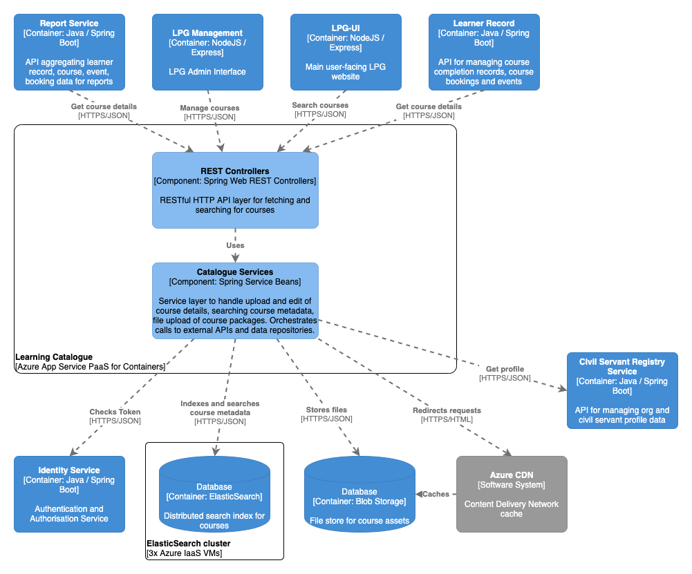

# Learning Catalogue

## Purpose

Spring Boot based RESTful API for uploading course materials (SCORM packages, single files, etc) and indexing metadata of courses (title, description, etc). Course metadata is stored in ElasticSearch running in an IaaS-managed VM cluster and content files are uploaded to Azure Blob Storage for persistence and replication. Azure CDN is also configured to cache course contents referenced in Blob Storage, so Learning Catalogue returns course content URLs prefixed with the CDN path. Learning Catalogue is called directly by LPG-UI and LPG-Management for searches and also by other APIs for fetching specific course details.

## Component overview

See the `diagram/` folder for diagram source in draw.io XML format

## Dependencies

### Build-time

For a complete list of build dependencies check the `build.gradle` file. The main source dependencies are:  
- Spring Boot 2.0 (web, jetty, jersey, security, config)
- Spring Security OAuth2 2.3.3
- Spring Data elasticsearch
- Azure Storage 8.0
- Azure App Insights 2.5

### Test-time

For a complete list of test dependencies check the `build.gradle` file. The main test dependencies are:  
- Spring Boot Starter Test
- Spring Boot Security Test
- mockito 2.8
- powermock 1.7

### Runtime 

#### Other LPG Services

- `identity-service` for OAuth token validation on all requests
- `learner-record` for retrieving data on event bookings associated with courses
- `civil-servant-registry-service` for getting organisation data

#### External integrations

- Azure CDN referenced in returned content paths to ensure caching of Azure blob storage hosted files

#### Data Stores

- Azure blob storage for persistence of course materials
- ElasticSearch for indexing course metadata

#### Data migrations

- none

## Build, run, test, deploy

The application requires Java 8 (OpenJDK 8) installed to build and run.

Build the application using Gradle `./gradlew build`.

Run the project with `./gradlew bootRun` or import the project into your IDE of choice such as IntelliJ or VS Code use the IDE commands to Run Application.

Run the unit tests using `./gradlew test` or choose individual test classes or packages using your IDE.

Integration tests relying on ElasticSearch can be run using `./gradlew integrationTest` and will execute the tests ending in 'IT' after attempting to start ES on local ports 9998/9999 (see `build.gradle` for more).

The application is packaged as a docker container image and includes an Azure App Insights Java agent for collecting metrics from the app - see `Dockerfile` in the root directory for the container definition. `hammer` is the log collector used for aggregating log output.

The application also inclues a `Jenkinsfile` to define the Jenkins build pipeline stages and linking it to the docker image repository and correct terraform module.

Deployment is controlled via the Terraform scripts in the main PaaS repository, with per-environment configuration values referenced there and secrets injected from keybase.

## Configuration

Significant configuration properties are highlighted here. For the full configuration file see `src/main/resources/application.yml`

- `oauth` connection settings for the identity-service used to validate bearer tokens
- `record` connection settings and paths for the learner-record service
- `registry` connection settings for the civil-servant-registry-service
- `elasticsearch` connection settings for the ElasticSearch cluster
- `azure` connection settings for Azure storage account and path to blob store

## Licenses

Learning Catalogue is licensed by the MIT license, see `LICENSE` in the root folder for details. Dependent applications are licensed as according to their respective readme and license files.

